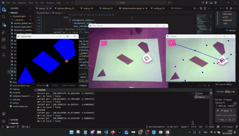
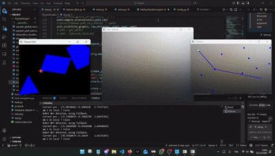
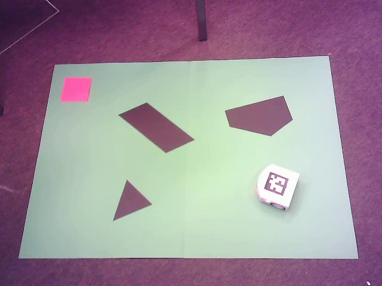

# 🤖 Thymio Autonomous Navigation: Vision & EKF Fusion

>**A robust multi-modal navigation stack utilizing computer vision and Extended Kalman Filters (EKF) for precise localization.**

---

## 📌 Project Overview
This project implements an autonomous navigation system for the Thymio II robot. The system integrates **global path planning**, **local obstacle avoidance**, and **real-time state estimation** to navigate a map, reach a target goal, and handle dynamic disturbances such as "kidnapping" or sensor occlusion.

  
  
  
<em>Left: Position estimation after kidnapping. Right: Robustness to blind vision</em>

---

## 🛠️ System Architecture

### 1. Vision System
The perception layer is built using **OpenCV** to extract environmental data from a monocular camera feed.
* **Map Detection:** Thresholding techniques are used to identify the green map boundaries, black obstacles, and the red goal.
* **Robot Tracking:** Real-time localization of the Thymio is achieved through **ArUco marker** detection placed on the robot's chassis.

### 2. State Estimation (Extended Kalman Filter)
The core of the localization stack is an **Extended Kalman Filter (EKF)** designed to provide robust position and orientation $(\hat{x}, \hat{y}, \hat{\theta})$ estimates.
* **Prediction Step:** Uses the robot's differential drive kinematics and wheel velocities to predict the next state.
* **Update Step:** Fuses global vision data (ArUco position) with the predicted state to correct for odometry drift.
* **Resilience:** The EKF allows the robot to maintain an accurate position estimate even when the camera is temporarily hidden by utilizing dead-reckoning.

### 3. Navigation & Control
* **Global Navigation:** Computes an optimal path from the start to the red goal while avoiding static obstacles.
* **Local Navigation:** Employs reactive behaviors to navigate around unexpected obstacles placed in the robot's path.

---

## 📈 Experimental Results
The system was validated across three critical scenarios:
1. **Nominal Case:** Successful navigation with global planning and local obstacle avoidance.
2. **Kidnapping:** The EKF and vision system successfully re-localized the robot after it was manually moved to a new position.
3. **Occlusion:** The robot continued its trajectory using wheel odometry when the camera feed was obstructed, demonstrating the filter's reliability.

  

---

### 🎓 Acknowledgments
Developed as part of the Basics of Mobile Robotics curriculum at **EPFL**.
* **Collaborators:** Aayushi Barve, Paul Bourgois, Alexandros Dellios, Mathys Gamper.
* **Supervision:** Prof. Francesco Mondada.
